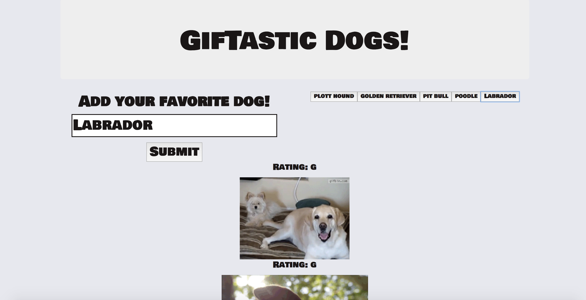

# GifTastic-Dogs

Using the GIPHY api in the best possible way: To look for dogs.

[GifTastic-Dogs](https://peterjuff.github.io/GifTastic-Dogs/)

## Instructions

* Click on a button to get gifs for the type of dog desired.
* Add your own dog to the list via the search bar.
* The gifs will first appear in a still state. To make them come to life, click on one. Click again to make it still again.

## Tools and Software

* [JQuery](https://jquery.com/)
* [Bootstrap](https://getbootstrap.com/)
* [API](https://giphy.com/)

# Authors

* [Peter Juffernbruch](https://github.com/peterjuff)

# Acknowledgments

* [Northwestern University Coding Bootcamp](https://bootcamp.northwestern.edu/coding/)
* Homework week six